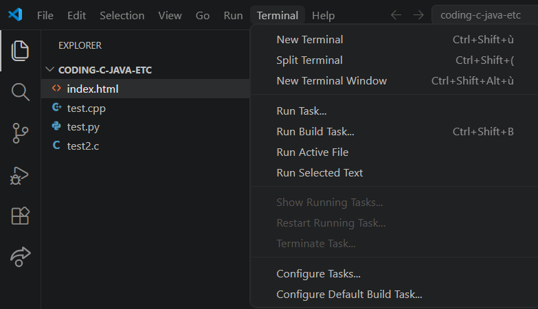
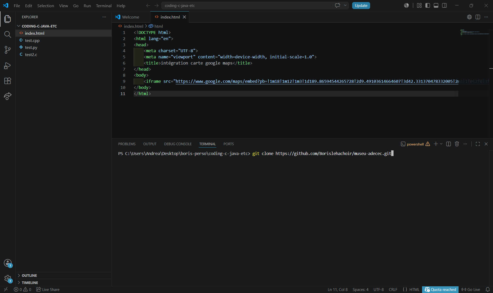
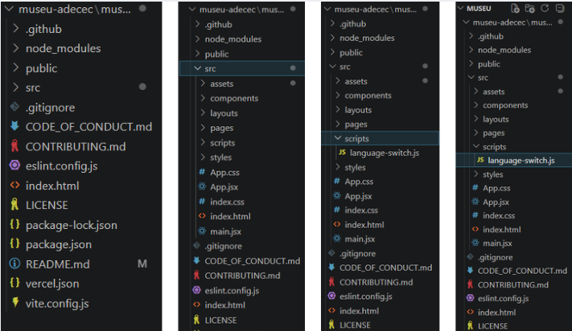
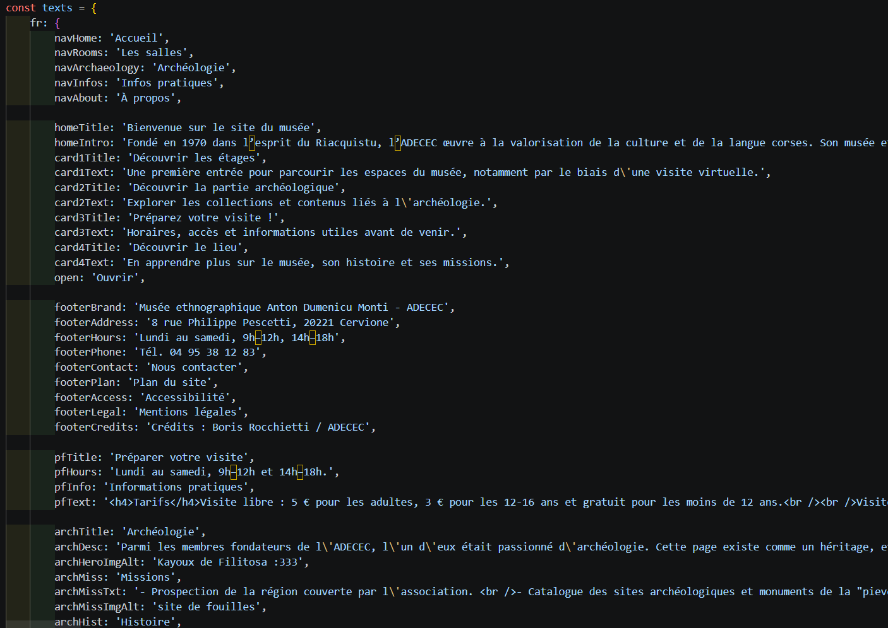
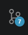
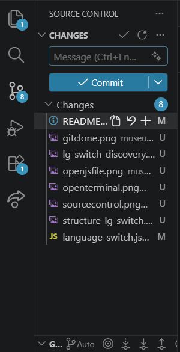
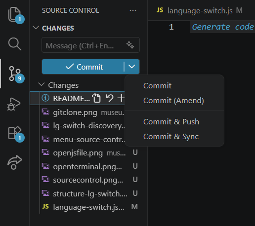

# React + Vite

This template provides a minimal setup to get React working in Vite with HMR and some ESLint rules.

Currently, two official plugins are available:

- [@vitejs/plugin-react](https://github.com/vitejs/vite-plugin-react/blob/main/packages/plugin-react) uses [Oxc](https://oxc.rs)
- [@vitejs/plugin-react-swc](https://github.com/vitejs/vite-plugin-react/blob/main/packages/plugin-react-swc) uses [SWC](https://swc.rs/)

### React Compiler

The React Compiler is not enabled on this template because of its impact on dev & build performances. To add it, see [this documentation](https://react.dev/learn/react-compiler/installation).

### Expanding the ESLint configuration

If you are developing a production application, we recommend using TypeScript with type-aware lint rules enabled. Check out the [TS template](https://github.com/vitejs/vite/tree/main/packages/create-vite/template-react-ts) for information on how to integrate TypeScript and [`typescript-eslint`](https://typescript-eslint.io) in your project.

# Additional notes for Vercel, etc

## Start the project

```bash
npm install
npm run dev
```

## Build

```bash
npm run build
```

## Vercel deployment (I already did it but I put it here if you wish to create your own repository)

1. Push the project to a Github repository [(here's mine btw)](https://github.com/Borislehachoir/museu-adecec)
2. Go to [Vercel](https://vercel.com/)
3. Import the repository
4. Vercel normally detects Vite automatically.
    > [!NOTE]
    > If it ain't working, check if you didn't put your repository in private on Github, or play around with the *root* setting on Vercel.
    > Regarding the aforementioned *root* setting: the default setting looks like "./" or something like that.
    > If your Vite/React application is in a subfolder (as is the case in this project), you must indicate the correct root directory.

5. Command for build: `npm run build`
6. Output dir: `dist/`

No additional configuration is required.

# Guide pour éditer les textes (s'il n'y a pas encore de back-office ou s'il n'a pas encore été complété): 
Version française pour confort d'usage par l'utilisateur (ici le personnel de l'ADECEC).
## Informations préalables
> [!IMPORTANT]
> Le back office a été partiellement réalisé sous la forme d'une base de données NoSQL Firestore Database avec une base de données et un système d'authentification avec email + mot de passe, Vercel ne supportant pas le langage informatique PHP. Pour y accéder, rechercher "*Firebase*" sur votre moteur de recherche favori, cliquersur "*Go to Console*", se connecter avec **pcjac@adecec.net**, et entrer sur le projet *adecec-muse* (ou *adecec-museu*). Pour instaurer ces changements à l'avenir, une restructuration de l'architecture du *language-switch.js* et l'insertion d'un fichier *firestore.js* avec le Web SDK (disponible sur Paramètres > Général > Vos applications) devront être implémentés. 

Matériel nécessaire : [Git](https://git-scm.com/), [VS Code](https://code.visualstudio.com/download), [GitHub](https://github.com/JacPaoli). 

Tutoriel utile : [Commencer Git & GitHub (niveau débutant)](https://doto.ovh/semestre_1/produire_Un_Site_Web/hebergement)

## Guide
### **ETAPE 1** : 
Ouvrir VS Code, et se connecter à GitHub. Créer un dossier (museu, adecec-museu, etc)

### **ETAPE 2** (à ne faire qu'une seule fois) : 
    - Ouvrir un nouveau terminal sur VS Code;
    
    - Cloner le repository (voir Tutoriel pour voir méthode si nécessaire).
    ```
    git clone https://github.com/Borislehachoir/museu-adecec.git
    ```
    

### **ETAPE 3** : 
Ouvrir le dossier **museu-adecec** ainsi cloné. Et là, c'est le drame. *Il y a plein de fichiers de partout oh mon dieu au secours mais quelle horreur je vais mourir pourquoi l'informatique c'est aussi compliqué Battì est vraiment un garçon courageux moi je peux vraiment pas hein.* <br>
Pas de panique. Respirer, fermer les yeux, penser à un bon souvenir. Appuyer sur **src**, puis **scripts** et poser votre curseur sur *language-switch.js*.
    

### **ETAPE 4** : Ouvrir *language-switch.js*. 



> [!TIP]
> Introduction d'un raccourci qui vous sera très utile par la suite : Pour rechercher un mot en particulier dans un fichier, faites Ctrl + F (Windows) ou Cmd + F (Mac). 

> [!IMPORTANT]
> Petit dico pour les non-anglophones ou pour comprendre mes abréviations sorties (pour rester poli) d'on ne sait où : <br>
> **Title** = Titre ; <br> **Btn** = Button/ Bouton ; <br> **Card** = Carte (ici, les jolies boîtes qu'on survole, notamment sur la page d'accueil) ; <br>**Footer** = Pied de page ; <br>**Brand** = marque (ici le nom de l'entreprise) ; <br>**Hero** = pas Superman :c. Fait référence dans cette situation au contenu principal (*main content*) ; <br>**Miss** = Missions ;<br>**Hist** = Histoire ;<br> **Breadcrumb** : en haut d'une page, un élément pour mieux visualiser là où on se trouve. Signifie "Miette de pain" ; <br> **Plusieurs mots** qui ont leur traduction juste à côté, dont par ex. Church. <br> **Tech** = Technology/ies (utilisée dans le site) ; <br> **Remedy** : littéralement Remédier, ici dans le sens *"solutions pour remédier"*, synonyme du *"voies de recours"* utilisé dans le site. 

Vous y trouverez les sections suivantes : 
    - fr (français)
    - en (anglais)
    - co (corse)
Dans chaque section, il y a le contenu de toutes les pages. 
    - **nav** : textes de la barre de navigation (header)
    - **home** (jusqu'à **open**) : tout ce qui est page d'accueil ;
    - **footer** : les informations disponibles dans le pied de page ;
    - **pf** : informations du composant Pré-Footer (avec carte OpenStreetMap, etc) ;
    - **arch** : la section archéologie et son contenu ;
    - **rooms** : page de la visite virtuelle (`pages/LesSalles.jsx`), de la présentation des salles et du guide ;
    - **nf** : Page d'erreur 404 - Not Found ;
    - **about** : Page "A propos" et ses textes ;*
    - **infos** : Page "Infos Pratiques" ; 
    - **access** : Page de déclaration d'accessibilité (accessible depuis le footer sur le site)

### **ETAPE 5** : Modifier un texte dans *language-switch.js*. 

Il est **TRES IMPORTANT** de comprendre comment sont construites les chaînes de caractères que vous manipulez. Suivant la construction de votre ligne, vous pourrez ou ne pourrez pas sauter une ligne à l'intérieur de votre chaîne de caractère. 
Par exemple, pour une chaîne écrite sur une seule ligne, et où vous n'aurez pas besoin de revenir à la ligne suivante, la forme suivante convient : 

```
exemple : 'exemple de texte', 
```

Cependant si vous souhaitez sauter une ligne avec cette construction-là, votre fichier sera envahi de rouge : les languages informatiques sont, il faut dire les termes, particulièrement cons. Quand votre language lit cette ligne (avec ' '), il lit tout la ligne d'un coup, et puis il dit *"c'est bon c'est fini allez hop pause café"*. En sautant une ligne, il est frappé de confusion et il reste bloqué en boucle sur la même erreur. *"Mince, mais où qu'elle se finit la ligne ? Rah j'y arrive pas. Pourquoi qu'elle finit pas cette p--n de ligne?!"*. 

Pour soulager ce pauvre J.-S., il faut donc lui proposer une autre forme de chaînes de caractères : 

```
exemple : `exemple de texte un peu plus long qui nécessite de sauter une ligne sinon c'est ingérable`, 
exemple : `exemple de texte un peu plus long qui 
nécessite de sauter une ligne sinon c'est ingérable`, 
```

Là, parce que vous utilisez des backticks (ou accents graves en français), le langage comprend qu'il doit continuer à la lire le fichier jusqu'à trouver le prochain backtick. Et une fois cette opération faite, il continue sur la prochaine ligne, et ainsi de suite. 
A la fin d'une chaîne de caractères, après l'avoir fermée avec un backtick (`) ou une apostrophe ('), veuillez à ne jamais oublier de mettre une virgule. C'est ce symbole qui permet au language de comprendre qu'il a fini de lire la ligne, et qu'il en attaque une nouvelle. 
**CE QUI EST RECOMMANDE** : Copier-coller votre texte dans l'espace entre les backticks/apostrophes. 

```
exemple : `exemple de texte un peu plus long qui nécessite de sauter une ligne sinon c'est ingérable`, 
exemple : `lagtrain - inabakumori (english subs)`, 
```

> [!TIP]
> La balise `<br/>` (*breakreset*) que vous voyez un peu partout depuis tout à l'heure sert à revenir dans la ligne. En mettre deux permet de laisser un espace d'environ deux lignes entre deux paragraphes.

 ### **ETAPE 6** : Valider les modifications

Félicitations, vous avez terminé de modifier le texte. Mais il faut maintenant valider ces modifications. 
- Pour cela, rien de plus simple :      
    - Rendez-vous sur la rubrique Source Control (voir icône ci-dessous). Un chiffre s'affiche : c'est le nombre de fichiers ayant été ajoutés/modifiés/supprimés que vous devez à présent commit.
    
<br/>   
    - Pour commit des modifications, cliquez sur l'icône de Source Control. Vous arrivez sur le menu suivant.
    
<br/> 
    - Ici, vous pouvez voir une case avec écrit Message, et en dessous un bouton avec écrit Commit. Appuyez sur Commit. Vous devriez avoir le menu suivant : 
     
    Ecrivez votre message (par ex. "correction traduction corse page accueil), puis sélectionnez Commit & Push. 

### **ETAPE 7** : Faire un tour sur le site et admirer votre super travail.

Félicitations ! Vous êtes venu.e.s à bout du démon Programmation ! Il est espéré que ce tutoriel soit suffisamment vulgarisé pour être clair, et que les images vous aideront à mieux visualiser ce qui est écrit. Si des informations ne sont pas claires, n'hésitez pas à contacter le stagiaire qui a écrit ce tutoriel à votre attention. 

Nous vous remercions de votre attention, et vous prions d'accepter nos salutations les plus distinguées. 

La bise
